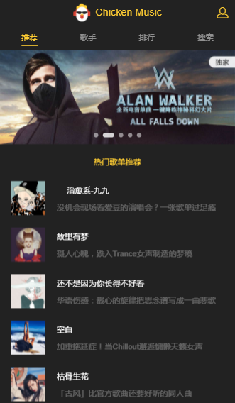
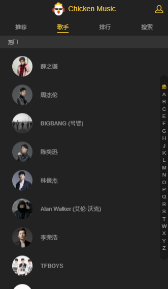
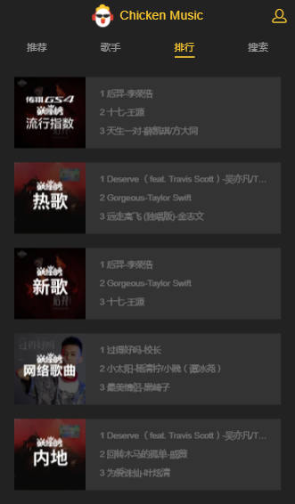
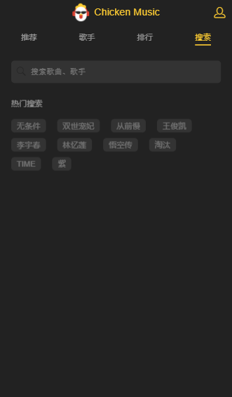

#  vue_music 音乐播放器实战
 本项目实战是从慕课网买来学习用的。
## 1、 需求分析
-    
## 2、vue-cli脚手架安装
- 初始化
- Runtime + Compiler 不基于vue.js开发
- Runtime-only 小6kb 依赖.vue文件开发
- vue-router
- ESlint 代码规范风格
- Karma +Mocha (本项目不需要测试)
- npm 4.0以上 和node 6.0以上
- vue-cli 初始化webpack配置，比如cd vue-music、npm install、npm run dev;
## 3、项目目录介绍及图表字体、公共样式等资源准备
- api 与后台数据交互的接口
- common 通用静态资源
- stylus css样式 需要手动加载 下载加载器
- components 公用组件
- router 路由
- store vuex相关代码
- App.vue
- main.js
- 别名的配置：可以有效解决路径的问题
## 4、页面入口+header组件的编写
+ index.html 理想视口
+ package.json 配置添加 
    - babel-runtime 对es语法转义;
    * fastclick 解决移动端300毫秒延迟;
        + fastclick的用法
        * 引入 import fastclick from 'fastclick'
        * 调用 fastclick.attach(document.body) 点击没有延迟
    - babel-polyfill 对es6api(promise)做一些转义;
## 5、路由配置+tab顶部导航栏组件开发
+ 配置路由index.js   
    ***
    + 导出一个new Router({
        routes:[
            {
                path:'/xxx',
                component:Recomend
             }
        ]  })
    ***
+ router-link 的tag 属性 告诉浏览器我要以什么标签渲染(默认是a标签);
    + &.router-link-active  vue自动添加的类名(可以修改他的样式);
    +  路由引入规范 import引入要大写
## 6、页面简介+轮播数据分析
## 7、jsonp原理介绍+Promise封装
    import originJSONP from 'jsonp'

    export default function jsonp(url,data,option){
        url += (url.indexOf('?') < 0 ? '?' : '&') + param(data)
        return new Promise((resolve,reject) => {
            originJSONP(url,option,(err,data) => {
                if (!err) {
                    resolve(data)
                } else {
                    reject(err)
                }
            })
        })
    }
    function param(data){
        let url = ''
        for (var k in data){
            let value =data[k] !== undefined ? data[k] : ''
            url += `&${k}=${encodeURIComponent(value)}`
        }
        return url ? url.substring(1) : ''
    }
## 8、jsonp的应用+轮播数据抓取
    import {} from ''   //必须要加花括号 export default 导出的不需要加花括号
+ 通常会在src/api目录下封装一些方法
+ Object.assign() 方法
  + Object.assign() 方法用于将所有可枚举的属性的值从一个或多个源对象复制到目标对象。它将返回目标对象。
  + 语法 Object.assign(target, ...sources)
  + This is [Object.assign()的官方文档](https://developer.mozilla.org/zh-CN/docs/Web/JavaScript/Reference/Global_Objects/Object/assign "官网") inline link.

## 9、轮播图组件实现
+ vue 中solt插槽
+ better-scroll     
+ 抽象dom操作 新建一个dom.js处理dom相关的操作
+ 一个常见的问题就是 
  + 代码执行时机的问题，也就是你还没有请求到数据的时候，你处理数据逻辑的代码已经执行完了，
+ 轮播图下面小点的实现

      ：class="{active:currentPageIndex===index}"
+ 监听窗口大小的事件
 
      window.addEventListener('resize',()=>{})

+ 引库之间需要注意 库与库之间的冲突，（点击事件的冲突或a标签默认跳转）
+ 当我们在组件里会有一些类似计时器的方法，在组件销毁的时候一定要把组件里的定时器清理

      destroyed(){
          clearTimeout()
      }

## 10、歌单数据接口分析

+  axios [官方文档](https://www.npmjs.com/package/axios "点击")
+ promise.resolve() [官方文档](https://developer.mozilla.org/zh-CN/docs/Web/JavaScript/Reference/Global_Objects/Promise/resolve)

## 11、歌单列表组开发和数据应用
+ flex 布局 
       
       justify-content：center;//水平居中
       flex-direction:column;//垂直居中

## 12、scroll组件的抽象和一应用
+ 获取数据的前后时机
## 13、vue-lazyload懒加载插件介绍和应用
+
